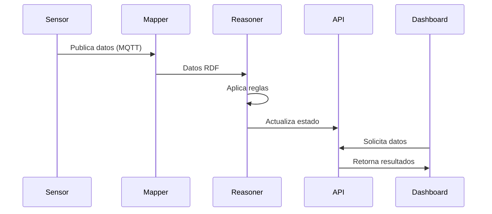

# 2. Arquitectura del Sistema

## 2.1 Visión General

El sistema implementa una arquitectura de microservicios que se alinea con las capas definidas en el Framework SWoT:

### Mapeo de Capas del Framework
```
Framework SWoT          →    Implementación Demo
------------------          -------------------
Capa de Dispositivos   →    Servicio 'sensors'
Abstracción Semántica  →    Servicio 'mapper'
Gestión Conocimiento   →    Servicio 'reasoner'
Capa de Servicios      →    Servicios 'api' y 'gateway'
Capa de Aplicación     →    Servicio 'dashboard'
```

### Flujo de Datos
1. Los sensores simulados generan datos ambientales
2. Los datos se publican vía MQTT
3. El mapper transforma los datos a RDF
4. El reasoner aplica reglas y genera inferencias
5. La API expone los datos procesados
6. El dashboard visualiza la información

## 2.2 Componentes Principales

### 2.2.1 Servicio de Sensores (sensors)
```java
@Component
class SensorSimulator {
    // Configuración principal
    @Value("${MQTT_TOPIC}")
    private String topic;

    // Simulación de datos
    private final Random random = new Random();
    private final Map<String, SensorLocation> sensorLocations;

    // Métodos principales
    @Scheduled(fixedRate = 60000)
    public void simulateSensorData() {
        // Genera datos cada minuto para cada sensor
    }
}
```

Características:
- Simula 10 nodos de sensores distribuidos
- Genera datos realistas dentro de rangos predefinidos
- Implementa comunicación MQTT con QoS 2
- Soporta reconexión automática

### 2.2.2 Servicio de Mapeo (mapper)
```java
@Service
public class SemanticMapperService {
    private static final String SOSA_NS = "http://www.w3.org/ns/sosa/";
    private static final String QUDT_NS = "http://qudt.org/schema/qudt#";

    public void mapSensorDataToRDF(SensorNodeRecord data) {
        // Transforma datos de sensores a RDF usando ontologías estándar
    }
}
```

Características:
- Mapeo automático a ontologías estándar
- Validación de datos de entrada
- Gestión de metadatos y provenance
- Soporte para múltiples formatos de salida

### 2.2.3 Servicio de Razonamiento (reasoner)
```java
@Component
public class SemanticReasoner {
    private void extractInferences(InfModel infModel, Model newInferences) {
        // Proceso de inferencia sobre datos semánticos
    }

    @Scheduled(fixedRate = 60000)
    public void performReasoning() {
        // Ejecución periódica del razonador
    }
}
```

Características:
- Procesamiento de reglas SPARQL
- Generación de alertas basadas en umbrales
- Inferencia de situaciones complejas
- Optimización de consultas

### 2.2.4 API REST (api)
```java
@RestController
@RequestMapping("/api/v1/enviroment")
public class EnvironmentalController {
    @GetMapping("/{sensor-type}")
    public ResponseEntity<Page<SensorReading>> getReadings(
            @PathVariable String sensorType,
            @RequestParam(required = false) Integer page,
            @RequestParam(required = false) Integer size) {
        // Recuperación paginada de lecturas de sensores
    }
}
```

Características:
- Endpoints RESTful documentados
- Soporte para paginación
- Filtrado por tipo de sensor
- Manejo de errores estandarizado

### 2.2.5 Gateway (gateway)
Implementado como proxy inverso que:
- Enruta peticiones a microservicios
- Implementa balanceo de carga
- Gestiona timeouts y reintentos
- Proporciona un punto único de acceso

### 2.2.6 Dashboard (dashboard)
```java
@Controller
public class DashboardController {
    @GetMapping("/")
    public String dashboard(Model model) {
        // Preparación de datos para visualización
        for (SensorType type : SensorType.values()) {
            model.addAttribute(type.getAlias() + "Readings",
                    dashboardService.getSensorReadings(type, 0, 10));
        }
        return "dashboard";
    }
}
```

Características:
- Visualización en tiempo real
- Gráficos interactivos
- Panel de alertas
- Filtros dinámicos

## 2.3 Interacción entre Componentes

La comunicación entre componentes se realiza mediante:
- MQTT para datos de sensores
- HTTP/REST para APIs
- TCP para acceso a triplestore
- Eventos asíncronos para notificaciones

### Diagrama de Secuencia Típico

